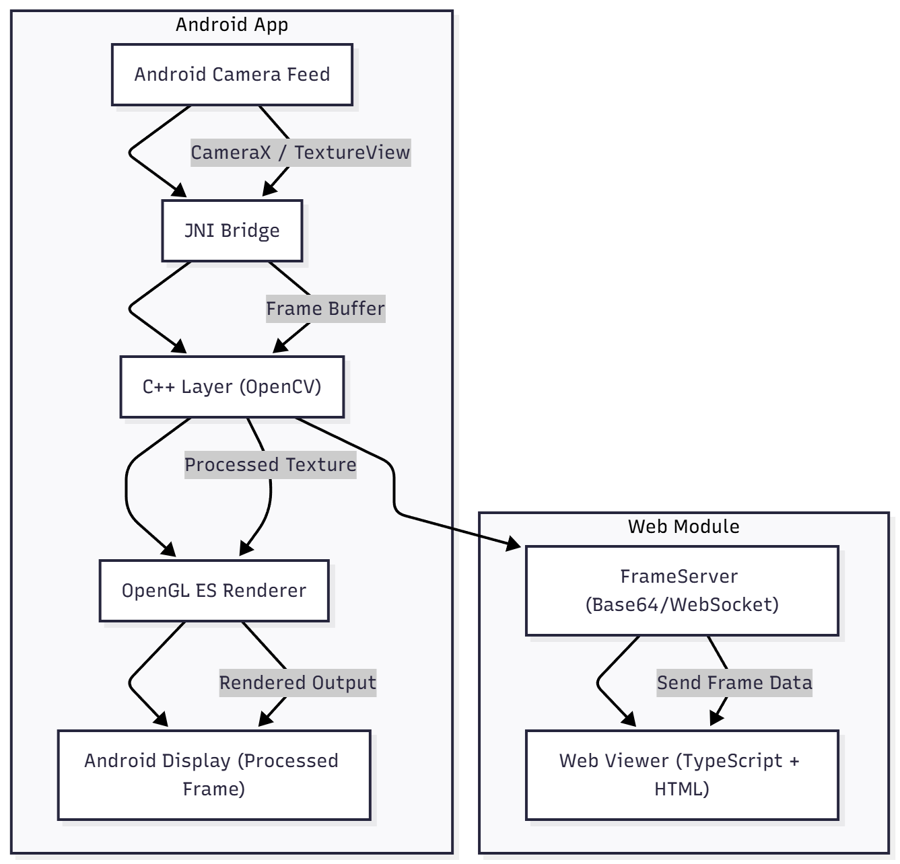
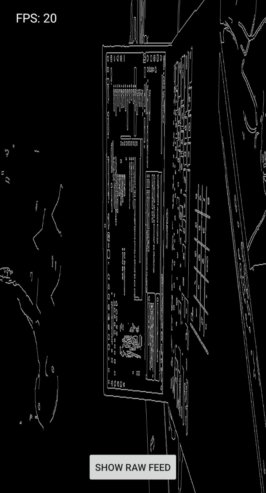
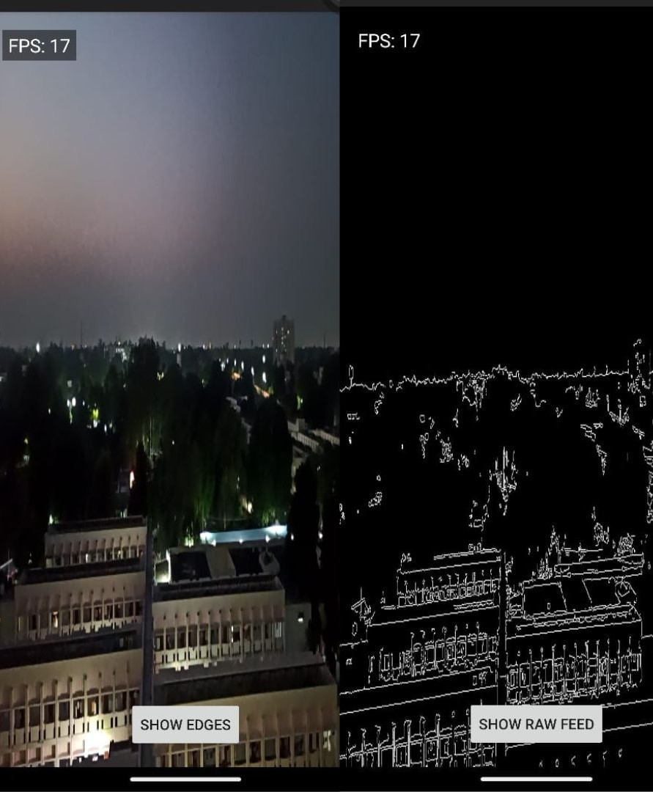

# Real-Time Edge Detection

This is a technical project showcasing real-time camera frame processing using **Android + OpenCV (C++) + OpenGL ES + JNI**. The app captures camera frames, applies OpenCV processing in native C++ code, and renders the results in real-time using OpenGL ES.

---

## Features Implemented
- **Camera Feed Integration (Android)**  
  Capture live camera frames using `TextureView` or `SurfaceTexture`.  

- **Frame Processing via OpenCV (C++)**  
  Apply Canny Edge Detection or Grayscale filter via JNI.  

- **Render Output with OpenGL ES**  
  Display processed frames as textures with smooth performance (10–15 FPS minimum).  

- **Web Viewer (TypeScript / WebSockets)**
  - Module to view real-time processed frames on a browser using a lightweight Node.js or local server setup.

- **Bonus Features**  
  - Toggle between raw camera feed and edge-detected output.  
  - FPS counter for monitoring performance.  

## Tech Stack Used

- **Kotlin**  

- **JNI (Java Native Interface)** 

- **NDK (Native Development Kit)** 

- **OpenCV**  
  
- **OpenGL ES**  

- **uWebSockets**  
  
- **TypeScript**  
  
## Architecture Overview



## Modules
- `/app` – Android code in Java/Kotlin handling camera and UI.  
- `/jni` – Native C++ code for OpenCV processing via JNI.  
- `/gl` – OpenGL ES renderer classes for frame display.
- `/web` - holds the TypeScript web viewer that receives and displays the camera feed.

## Project Flow:
1. Camera frames are captured in Android.  
2. Frames are sent to native C++ using JNI.  
3. OpenCV applies edge detection/grayscale filters.  
4. Processed frames are sent back to OpenGL textures for real-time rendering.  

---

# Android OpenCV Project Setup Instructions


## 1. Install Android Studio & SDK

1. **Download and Install Android Studio**
   - Go to the [Android Studio website](https://developer.android.com/studio) and download **Android Studio Bumblebee or later**.
   - Follow the installation instructions for your operating system (Windows/Mac/Linux).

2. **Install Required SDK Components**
   - Open Android Studio.
   - Navigate to **`Tools > SDK Manager`**.
   - Under **SDK Platforms**, make sure you have installed:
     - Android API Level 30 or later (depending on your project requirements).
   - Under **SDK Tools**, ensure the following are installed:
     - **NDK (Native Development Kit)** – required for building C++/native code.
     - **CMake** – used to build native libraries.
     - **LLDB** – for native debugging.
   - Apply changes and wait for the installation to finish.

3. **Verify Installation**
   - Open a terminal or command prompt.
   - Run:
     ```bash
     ndk-build --version
     cmake --version
     ```
   - Both commands should return version numbers, confirming proper installation.

---

## 2. Download and Configure OpenCV for Android

1. **Download OpenCV Android SDK**
   - Visit the [OpenCV Releases page](https://opencv.org/releases/).
   - Download the latest **OpenCV Android SDK** (e.g., `OpenCV-android-sdk-4.x.x.zip`).

2. **Extract the SDK**
   - Extract the contents to a known location.  
     Example: `C:/opencv-android-sdk` or `/Users/<username>/opencv-android-sdk`.

3. **Configure Project to Use OpenCV**
   - In your `CMakeLists.txt`, set the paths for OpenCV:
     ```cmake
     set(OpenCV_DIR "C:/opencv-android-sdk/sdk/native/jni")
     find_package(OpenCV REQUIRED)
     include_directories(${OpenCV_INCLUDE_DIRS})
     target_link_libraries(<your-target-name> ${OpenCV_LIBS})
     ```
   - Make sure the library paths match your extracted folder structure.

---

## 3. Build the Project in Android Studio

1. **Open the Project**
   - Launch Android Studio.
   - Select **File > Open** and navigate to your project folder.

2. **Sync Gradle**
   - Android Studio should prompt you to **sync Gradle** when opening the project.  
   - If not, click **File > Sync Project with Gradle Files**.

3. **Build the Project**
   - Use **Build > Make Project** or press `Shift + F10` to compile the project.
   - Ensure there are no errors in the `Build` window.

4. **Run on a Physical Device**
   - Connect an Android device with **USB Debugging enabled**.
   - Select your device in Android Studio.
   - Click **Run > Run 'app'** to install and start the application.
   - Note: The camera is required for testing OpenCV functionality.

---

## 4. Optional Configuration & Performance Tuning

1. **Adjust Camera Resolution**
   - Open `CameraRenderer.java` (or `.kt`) in your project.
   - Modify the resolution for better performance or quality:
     ```java
     camera.setPreviewSize(640, 480); // Lower resolution for faster processing
     ```

2. **Modify OpenGL Shaders**
   - Open the `/gl` folder in your project.
   - You can customize visual effects by editing vertex and fragment shaders.

3. **Enable Debug Logging**
   - In `MainActivity` or `CameraRenderer`, add logging to monitor frame processing:
     ```java
     Log.d("OpenCV", "Frame width: " + frame.width() + ", height: " + frame.height());
     ```

---

## 5. Additional Tips

- Always test on a physical device; emulators often have limited camera support.
- Keep OpenCV SDK updated to access the latest features.
- Use `adb logcat` to debug runtime issues related to OpenCV or camera access.


## 📸 Screenshots / GIFs

<table style="width:100%; table-layout:fixed;">
  <tr>
    <td align="center" width="50%">
      <strong>App Home Page</strong><br>
      
    </td>
    <td align="center" width="50%">
      <strong>Raw Camera Feed</strong><br>
      
    </td>
  </tr>
  <tr>
    <td align="center" width="50%">
      <strong>Side-by-Side Comparison</strong><br>
      
    </td>
    <td align="center" width="50%">
      <strong>Web Module</strong><br>
      
    </td>
  </tr>
</table>

---


## Notes
- All image processing is done in native C++ to ensure real-time performance.  
- Java/Kotlin code is kept minimal, focusing only on camera capture and UI.  
- OpenGL shaders are modular and can be extended for additional effects.  

---

**Enjoy exploring real-time edge detection with Android + OpenCV + OpenGL!**
